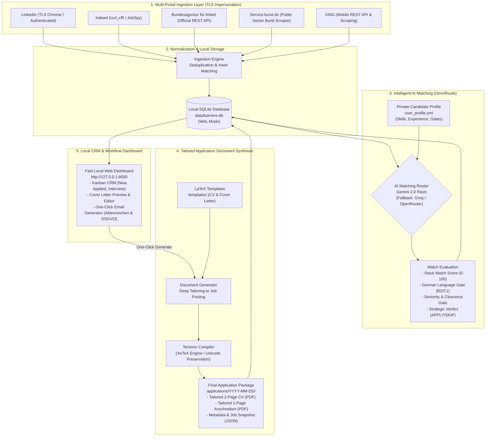

# Karriere Pipeline 🚀

[](https://www.python.org)
[](https://www.sqlite.org)
[](https://ai.google.dev)
[-008080.svg)](https://tectonic-typesetting.github.io)
[](https://github.com/yifeikong/curl_cffi)
[](#privacy-and-network-data-flow)
[](LICENSE)

An autonomous, local-first career intelligence engine and end-to-end job application pipeline built for the German software and engineering job market. It continuously scrapes jobs across 5 major portals, normalizes and deduplicates listings in SQLite, evaluates role fit against your private candidate profile using multi-provider LLMs, and automatically synthesizes tailored, ATS-compliant LaTeX CVs and DIN 5008 cover letters with local dashboard tracking.

---

## 🏗️ End-to-End System Architecture



---

## 🌟 Key Technical Highlights

### 1. Resilient Multi-Portal Scraping with TLS Impersonation
Job search platforms enforce strict anti-bot measures and IP reputation filters. Karriere Pipeline leverages:
- **`curl_cffi` Browser Impersonation**: Replicates Chrome/Safari JA3/JA4 TLS fingerprints and HTTP/2 settings to bypass cloudflare blocks on Indeed and LinkedIn.
- **Direct Official REST API Integration**: Integrates directly with the German Federal Employment Agency (*Bundesagentur für Arbeit*) and *Bund.de* APIs with automatic pagination and query batching.
- **Content Deduplication**: Tracks unique composite hashes (`company + title + location + clean_url`) to ensure zero duplicate entries across multiple platforms.

### 2. Multi-Model LLM Matching with OmniRoute Fallback
- **Tiered Evaluation Rubric**: Evaluates mandatory qualifications (*"Anforderungen"* / *"Ihr Profil"*), distinguishing between core target fits (Python, Backend, Data, Systems C++, Cloud), transferable adjacent domains, and hard disqualifiers.
- **Automated Language & Clearance Gating**: Flags strict C1/C2 German mandates versus English-friendly/B2 teams, and screens for EU/NATO defense clearance prerequisites.
- **OmniRoute Architecture**: Transparent failover from Google Gemini 2.0 Flash to Groq (Llama 3.3) or OpenRouter, guaranteeing zero pipeline interruptions during API quota limits.

### 3. Automated ATS Document Synthesis (LaTeX / Tectonic)
- **Strict Page Budget**: Automatically enforces strict standards: **Curriculum Vitae (2 pages)** and **Cover Letter (exactly 1 page DIN 5008 standard)**.
- **Tectonic XeTeX Engine**: Modern compilation pipeline using system fonts with zero complex TeXLive environment dependencies.
- **Typography & Unicode Preservation**: Uses `fontspec` and automated verification to guarantee German characters (`ä`, `ö`, `ü`, `ß`) are preserved in the PDF text layer without glyph corruption.

### 4. Local Web Dashboard & CRM Application Tracker
- **Fast, Lightweight Architecture**: Vanilla JS, sleek CSS, and Python `http.server` backend binding strictly to `127.0.0.1:8000`.
- **Complete Pipeline Control**: Trigger multi-portal scrapes, trigger AI evaluations, inspect matches, and preview compiled PDFs directly in-browser.
- **One-Click Email Generator**: Automatically extracts required reference codes (*Aktenzeichen*, e.g., for German public sector roles) and includes mandatory GDPR consent clauses (*datenschutzrechtliche Einwilligungserklärung*) into desktop email clients (`mailto:`) or clipboard.

---

## 🔒 Privacy and Network Data Flow

Karriere Pipeline is architected as a **local-first, privacy-respecting system**:
- **Candidate PII Protection**: Your personal contact details, address, phone number, work history, and custom LaTeX templates live strictly on your local machine in gitignored files (`user_profile.yml`, `templates/`, `data/`, `applications/`, `.env`).
- **AI Requests**: During matching and document generation, only the relevant candidate profile text and job description are transmitted to your configured LLM API (Google Gemini, Groq, or OpenRouter). No third-party servers store your data.
- **Git Synchronization Security**: Automatic Git push routines can be disabled via `compile --no-push` or setting `KARRIERE_GIT_SYNC=false`. Always keep private tracking repositories strictly **Private** on GitHub.

---

## 📁 Repository Structure

```text
karriere-pipeline/
├── src/
│   ├── ai/
│   │   ├── matcher.py         # Multi-model LLM matching engine & scoring logic
│   │   └── prompts.py         # Structured evaluation and application prompts
│   ├── core/
│   │   ├── config.py          # Configuration loader & profile validator
│   │   ├── filters.py         # Rule-based candidate & tech stack filtering
│   │   └── models.py          # Data models (Job, CandidateProfile, MatchResult)
│   ├── db/
│   │   ├── database.py        # SQLite connection manager & query helpers
│   │   └── schema.py          # Tables: jobs, matches, applications, crm_tracking
│   ├── generators/
│   │   ├── application.py     # LaTeX CV and Anschreiben template populator
│   │   ├── compiler.py        # Tectonic PDF compiler & typography linter
│   │   └── email.py           # Application email generator (DSGVO & Aktenzeichen)
│   ├── scrapers/
│   │   ├── ba.py              # Bundesagentur für Arbeit REST API client
│   │   ├── bund.py            # Service.bund.de public sector scraper
│   │   ├── indeed.py          # Indeed scraper via JobSpy / curl_cffi
│   │   ├── linkedin.py        # LinkedIn search & job details scraper
│   │   └── xing.py            # XING portal scraper
│   └── dashboard/
│       ├── server.py          # Local dashboard HTTP API server (127.0.0.1:8000)
│       ├── index.html         # CRM Web UI
│       ├── style.css          # Modern dark-mode UI styling
│       └── app.js             # Interactive frontend state controller
├── templates_example/         # Sanitized LaTeX templates (CV & Cover Letter)
├── filter_config.example.yml  # Example search keywords & portal settings
├── user_profile.example.yml   # Template for your private candidate profile
├── tests/                     # Comprehensive test suite (pytest)
├── main.py                    # Unified CLI command interface
├── pyproject.toml             # Packaging metadata & CLI tool registration
└── README.md                  # Comprehensive documentation
```

---

## 🛠️ Getting Started

### 1. Prerequisites
- **Python 3.10+** (3.11 recommended)
- **Tectonic LaTeX Engine**:
  - macOS: `brew install tectonic`
  - Linux: `sudo apt install tectonic` (or `curl --proto '=https' --tlsv1.2 -fsSL https://drop-sh.tectonic-typesetting.github.io | sh`)
  - Windows: `winget install Tectonic.Tectonic`

### 2. Installation
```bash
git clone https://github.com/Toya62/karriere-pipeline.git
cd karriere-pipeline

python3 -m venv .venv
source .venv/bin/activate
pip install -r requirements.txt
```

### 3. Configure Your Profile & Templates
```bash
# 1. Initialize your private profile
cp user_profile.example.yml user_profile.yml

# 2. Initialize your private templates
cp -r templates_example/ templates/

# 3. Initialize your search preferences
cp filter_config.example.yml filter_config.yml

# 4. Configure API keys
cp .env.example .env
```

Open `user_profile.yml` and enter your verified background, technical skills, degrees, and search criteria. Enter your `GEMINI_API_KEY` (and optional `GROQ_API_KEY` / `OPENROUTER_API_KEY`) in `.env`.

---

## 💻 CLI Command Reference

Karriere Pipeline provides a unified CLI tool:

### 1. Scrape Portals for New Listings
```bash
# Scrape all 5 portals for jobs posted within the last 24 hours
.venv/bin/python main.py scrape --portal all --days 1

# Scrape only LinkedIn and Bundesagentur without immediately running AI matching
.venv/bin/python main.py scrape --portal linkedin,ba --days 3 --no-match
```

### 2. Run AI Match Evaluation
```bash
# Evaluate the top 25 unscored jobs in SQLite against your profile
.venv/bin/python main.py match --limit 25
```

### 3. Generate Tailored Application Materials
```bash
# Synthesize tailored CV and Cover Letter for a specific job match
.venv/bin/python main.py apply --job-id 142
```

### 4. Compile LaTeX to PDFs
```bash
# Compile all newly generated .tex applications to PDFs via Tectonic
.venv/bin/python main.py compile --no-push
```

### 5. Launch the Local CRM Dashboard
```bash
.venv/bin/python main.py dashboard --port 8000
```
Open **[http://127.0.0.1:8000](http://127.0.0.1:8000)** to view your jobs, read tailored cover letters, and track application statuses.

---

## 🐳 Docker Deployment (Optional)

A lightweight containerized setup is provided for running the dashboard on home servers or NAS:

```bash
# Run dashboard locally in Docker (strictly bound to localhost)
docker run -d \
  -p 127.0.0.1:8000:8000 \
  -v $(pwd)/data:/app/data \
  -v $(pwd)/applications:/app/applications \
  ghcr.io/toya62/karriere-pipeline:latest
```

---

## 🧪 Test Suite

Run the automated test suite covering scrapers hygiene, config loading, matching fallbacks, and security gates:

```bash
.venv/bin/python -m pytest tests/ -v
```

---

## 📄 License
This project is open-source and licensed under the [MIT License](LICENSE).
